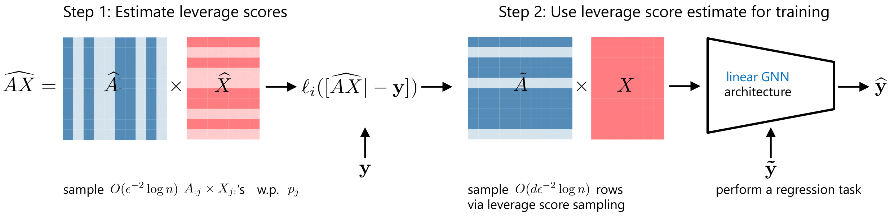

# Efficient Learning of Linear Graph Neural Networks via Node Subsampling (NeurIPS 2023)

https://neurips.cc/virtual/2023/poster/70314

## Summary



## Dependency

Please install dependencies by `pip install -r requirements.txt`.

[PyTorch](https://pytorch.org/) may not be installed due to GPU issues. Then please install it from the [official website](https://pytorch.org/) (e.g., by cpuonly flag).

## Files

* `runtime_and_memory_comparison.py` should run with memory_profiler and reproduces computation time and peak memory comparison between full AX and sampled AX under different sampling methods.
* `nonlinear_gnn_subsampling.py` reproduces nonlinear mse on datasets: house or ogbl-ddi datasets.
* `normal_equations.py` reproduces linear mse by normal equations on datasets: house, ogbl-ddi, facebook.
* `utils.py` defines GCN model, sampling methods when evaluating different datasets.

## Datasets

* house: https://github.com/nd7141/bgnn
* ogbl-ddi: https://ogb.stanford.edu/docs/linkprop/#ogbl-ddi
* ogbn-arxiv: https://ogb.stanford.edu/docs/nodeprop/#ogbn-arxiv
* facebook: https://snap.stanford.edu/data/ego-Facebook.html
* Synthetic data: generation according to Gaussian and Cauchy distribution


## Evaluation

Reproduce the results by the following commands.

```
$ python memory_profiler -m runtime_and_memory_comparison.py (dataset: house|ogbl-ddi|ogbn-arxiv|generated-data|facebook)
$ python nonlinear_gnn_subsampling.py (dataset: house|ogbl-ddi)
$ python normal_equations.py (dataset: house|ogbl-ddi|facebook)
```

The results are saved in `results` directiory.

### Results


## Citation

```
@inproceedings{shin2023efficient,
  title={Efficient Learning of Linear Graph Neural Networks via Node Subsampling},
  author={Shin, Seiyun and Shomorony, Ilan and Zhao, Han},
  booktitle={Thirty-seventh Conference on Neural Information Processing Systems},
  year={2023},
  url={https://openreview.net/forum?id=rQI3FOzo1f}
}
```
